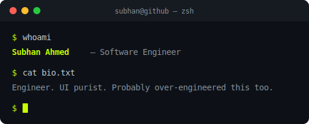

---

  

---

- I care how software feels, not just that it works
- Obsessed with systems that are clean under the hood — AI integrations, automation, the boring stuff done right
- Built my portfolio as a headless CMS with GitHub as CDN — a server for static data felt like overkill

---

<picture>
  <source media="(prefers-color-scheme: dark)" srcset="https://raw.githubusercontent.com/subhan-ahmd/subhan-ahmd/output/github-snake-dark.svg" />
  <source media="(prefers-color-scheme: light)" srcset="https://raw.githubusercontent.com/subhan-ahmd/subhan-ahmd/output/github-snake.svg" />
  
</picture>

